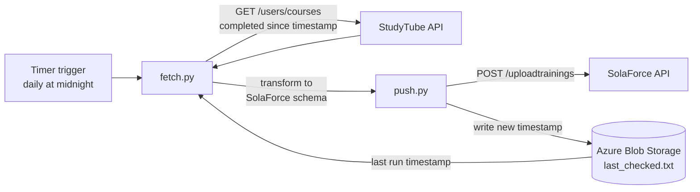

# Automated Training Data Transfer Between StudyTube and SolaForce

An Azure Functions integration that syncs completed training records nightly from
StudyTube, a learning platform, into SolaForce, an HR system — replacing a manual
copying step that was causing delays and errors in HR records.

`TODO(owner): how often did someone do this by hand, and how long did it take?
Put the answer in the sentence above — "replacing a manual step that took X hours
every Y" is the line a hiring manager remembers.`

## How it works



1. A timer trigger fires the function once a day.
2. `fetch.py` reads the last run's timestamp from a blob, requests an OAuth token,
   and pulls every course completed since that timestamp from StudyTube.
3. Records are transformed to match SolaForce's expected schema.
4. `push.py` uploads them and writes the new timestamp back to blob storage, so
   the next run picks up exactly where this one stopped.

The timestamp is only advanced after the upload succeeds, so a failed run is
retried on the next pass rather than silently skipping records.

## Technologies used

Python 3.12, Azure Functions (timer trigger), Azure Blob Storage, Azurite for
local development, REST APIs on both ends.

## Repository layout

| File | Role |
|---|---|
| `function_app.py` | Azure Function definition and timer trigger; wires fetch to push |
| `fetch.py` | OAuth token retrieval, StudyTube paging, transform to SolaForce schema |
| `push.py` | Uploads records to SolaForce and advances the stored timestamp |
| `host.json` | Azure Functions host configuration |
| `requirements.txt` | Python dependencies |
| `local.settings.json` | Local environment settings (not committed) |

## Installation & setup

1. Clone the repository.
2. Install dependencies: `pip install -r requirements.txt`
3. Create `local.settings.json` with the environment variables listed below.
4. Start Azurite, then run the function locally with `func start`.

## Environment variables

### Azure Storage (Azurite, local development)

```
"STORAGE_ACC_CONN_STRING": "DefaultEndpointsProtocol=http;AccountName=devstoreaccount1;AccountKey=Eby8vdM02xNOcqFlqUwJPLlmEtlCDXJ1OUzFT50uSRZ6IFsuFq2UVErCz4I6tq/K1SZFPTOtr/KBHBeksoGMGw==;BlobEndpoint=http://127.0.0.1:10000/devstoreaccount1;"
```

This is Azurite's standard public development key, not a credential. It is
identical on every Azurite install and grants access to nothing but a local
emulator.

```
"STORAGE_ACC_CONT_NAME": Name of the container in Azure Storage Account
"STORAGE_ACC_BLOB_NAME": Name of the blob in Azure Storage Account
```

### StudyTube API access

```
"STUDYTUBE_CLIENT_ID": StudyTube Client Id
"STUDYTUBE_CLIENT_SECRET": StudyTube Client Secret
"STUDYTUBE_TOKEN_URL": https://STUDYTUBE_INSTANCE/gateway/oauth/token
"STUDYTUBE_USERS_COURSES_URL": https://STUDYTUBE_INSTANCE/api/v2/users/courses
```

### SolaForce API access

```
"SOLAFORCE_USER_ID": SolaForce User's Id
"SOLAFORCE_USER_KEY": SolaForce User's Key
"SOLAFORCE_API_URL": https://SOLAFORCE_INSTACE/d/json/uploadtrainings
```

## Logging

Each run logs its outcome. With no new records it logs "No new trainings to
export. No data to send."; otherwise it logs how many records were uploaded.
Failures to retrieve a token or reach either API are logged as errors, and a
single malformed record is logged and skipped rather than failing the whole run.

## Testing

Tested in the test environments of both systems. Verified:

- **Checkpointing** — the stored timestamp advances only after a successful
  upload, and a run with no new records still advances it without posting.
- **Incremental fetch** — re-running immediately after a successful run picks up
  no duplicates.
- **Error paths** — failed OAuth token retrieval, failed StudyTube fetch and
  failed SolaForce upload are each caught and logged, leaving the timestamp
  unchanged so the next run retries the same window.
- **Malformed records** — a record that fails transformation is skipped and
  logged without aborting the batch.

`TODO(owner): confirm this list matches what the team actually exercised, and
remove anything that was not tested. No automated test suite is committed.`

## Limitations / notes

- Maximum allowed length for `trainingTypeStr` is 63 characters in SolaForce.
- No automated tests are committed; verification was manual against both test
  environments.
- `TODO(owner): the timer is configured as "0 0 * * *" and the schedule is
  described as midnight Finnish time. Azure evaluates NCRONTAB in UTC unless
  WEBSITE_TIME_ZONE is set on the Function App. Confirm which applies in the
  deployed environment and correct this line either way.`

## Client

Built for a Finnish client company as a Metropolia University of Applied Sciences
project.
`TODO(owner): confirm with Halton whether the client can be named publicly. If
yes, replace "a Finnish client company" with Halton Oy throughout.`

## Development

Work was done on feature branches and merged to `main` through pull requests —
11 merged, across two contributors.

## Authors

Metropolia project team. Anastasiia Kosareva ([@AnastasiiaX](https://github.com/AnastasiiaX))
authored 9 of the 11 merged pull requests; [@Elfutbalgoat](https://github.com/Elfutbalgoat)
authored the other two.
`TODO(owner): add your teammate's real name if they are happy to be credited, and
a one-line split of who owned which part of the integration.`
